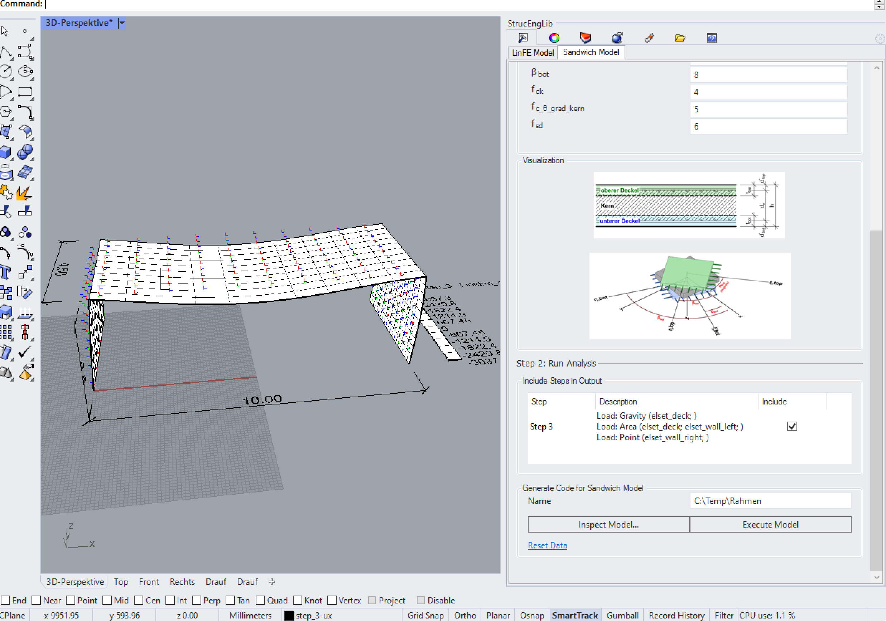

# StrucEng Library Rhinoceros Plugin

The StrucEng Library Plugin unites and extends Finite Element Analysis of [Compas FEA](https://compas.dev/compas_fea/latest/) into [Rhinoceros 3D](https://www.rhino3d.com/).

It features Rhino user-interfaces and bundles various FE models to support the structural analysis of reinforced concrete and masonry.

<figure markdown>
  
  <figcaption>StrucEng Library Plugin in Action</figcaption>
</figure>

The following pages will assist the installation of the plugin in Rhinoceros 3D. Start with the [Prerequisite Steps](./getting_started.md)
to ensure you have all necessary software components installed.
